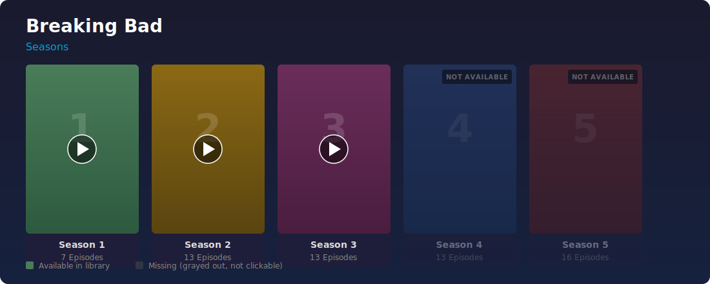

# Jellyfin Missing Seasons Extension

A Jellyfin web client plugin that shows **missing seasons** in your series library as grayed-out, non-clickable indicators. It uses [TMDB (The Movie Database)](https://www.themoviedb.org/) to determine which seasons exist for a series and highlights the ones you don't have yet.

## Screenshot



*Seasons 1–3 are available in the library. Seasons 4 and 5 are detected from TMDB and shown as grayed-out, non-clickable cards with a "Not available" badge.*

## Features

- **Missing season detection** — Compares your Jellyfin library against TMDB data to find seasons you don't have.
- **Grayed-out cards** — Missing seasons appear with reduced opacity, grayscale filter, and a "Not available" badge.
- **Non-interactive** — Missing season cards are fully unclickable (no navigation, no play buttons).
- **Artwork loaded** — Poster art for missing seasons is fetched from TMDB and displayed (in grayscale).
- **Only released seasons** — Upcoming/unaired seasons are excluded based on their air date.
- **Specials excluded** — Season 0 (Specials) is never shown as missing.
- **Correct ordering** — Missing seasons are inserted in the correct position among your existing seasons.
- **Settings dialog** — A gear icon lets you configure your TMDB API key without editing files.

## Requirements

- Jellyfin Server 10.8 or later
- A free [TMDB API key (v3)](https://www.themoviedb.org/settings/api)
- Your series must have TMDB metadata (most series do when using the default metadata providers)

## Installation

### Step 1: Get a TMDB API Key

1. Create a free account at [themoviedb.org](https://www.themoviedb.org/signup)
2. Go to [Settings → API](https://www.themoviedb.org/settings/api)
3. Request an API key (choose "Developer" → fill in details)
4. Copy the **API Key (v3 auth)** — you'll need it in Step 3

### Step 2: Install the Plugin Script

Choose one of the three installation methods below:

#### Option A: Tampermonkey / Userscript (Easiest)

This method works in any browser and requires no server access.

1. Install the [Tampermonkey](https://www.tampermonkey.net/) browser extension
2. Click the Tampermonkey icon → **Create a new script**
3. Delete the template content and paste the entire contents of [`missing-seasons.js`](missing-seasons.js)
4. Update the `@match` lines in the header to match your Jellyfin URL:
   ```
   // @match        https://jellyfin.richardhomelab.com/*
   ```
5. Press `Ctrl+S` / `Cmd+S` to save
6. Navigate to your Jellyfin instance — the plugin loads automatically

#### Option B: Custom JavaScript Injection (Server Admin)

This method uses Jellyfin's built-in branding feature to inject the script.

1. Open your Jellyfin admin **Dashboard**
2. Go to **General** → scroll to **Custom CSS and scripting** (or **Branding** section)
3. In the **Custom JavaScript** field, paste the entire contents of [`missing-seasons.js`](missing-seasons.js)
4. Click **Save**
5. **Hard-refresh** your browser (`Ctrl+Shift+R` / `Cmd+Shift+R`)

> **Note:** If your Jellyfin version doesn't have a Custom JavaScript field in the UI, see Option C.

#### Option C: Manual File Placement

1. Locate your Jellyfin web client directory:
   - **Docker:** `/usr/share/jellyfin/web/`
   - **Linux (package):** `/usr/lib/jellyfin/bin/jellyfin-web/`
   - **Windows:** `C:\Program Files\Jellyfin\Server\jellyfin-web\`
   - **macOS:** `/Applications/Jellyfin.app/Contents/Resources/jellyfin-web/`

2. Copy `missing-seasons.js` into that directory:
   ```bash
   # Example for Docker
   docker cp missing-seasons.js jellyfin:/usr/share/jellyfin/web/missing-seasons.js
   ```

3. Edit the `index.html` file in that same directory and add the following line just before the closing `</body>` tag:
   ```html
   <script src="missing-seasons.js"></script>
   ```

4. Restart Jellyfin or hard-refresh your browser.

> **Warning:** Manual file placement will be overwritten when Jellyfin updates. You'll need to re-apply after updates.

### Step 3: Configure the TMDB API Key

1. Open Jellyfin in your browser
2. Click the **⚙ gear icon** in the bottom-right corner of the screen
3. Paste your TMDB API key (v3) into the input field
4. Click **Save**
5. Navigate to any series — missing seasons will appear automatically

If you don't see the gear icon, hard-refresh your browser (`Ctrl+Shift+R`).

## How It Works

1. When you navigate to a series detail page, the plugin detects the series ID from the URL.
2. It fetches the series metadata from Jellyfin's API to get the TMDB Provider ID.
3. It queries the [TMDB TV API](https://developer.themoviedb.org/reference/tv-series-details) for all seasons of that series.
4. It compares TMDB's season list against your Jellyfin library seasons.
5. For each missing (but released) season, it creates a card with the TMDB poster art, applies a grayscale filter + reduced opacity, and inserts it in the correct order among your existing season cards.

## Uninstallation

- **Option A (Tampermonkey):** Open Tampermonkey dashboard → delete the "Jellyfin Missing Seasons" script.
- **Option B:** Remove the script from Dashboard → General → Custom JavaScript and save.
- **Option C:** Remove `missing-seasons.js` from the web directory and undo the `index.html` edit.
- Clear the stored API key: open browser DevTools → Console → run:
  ```js
  localStorage.removeItem('jellyfin-missing-seasons-tmdb-api-key');
  ```

## Troubleshooting

| Issue | Solution |
|-------|----------|
| No missing seasons appear | Check the browser console (`F12`) for `[MissingSeasons]` log messages. Ensure the series has a TMDB ID in its metadata. |
| "No TMDB API key configured" | Click the gear icon (⚙) and enter your TMDB API key. |
| Missing seasons appear but no artwork | The season may not have poster art on TMDB. The card will still show with a dark placeholder. |
| Cards appear but styling is wrong | Hard-refresh (`Ctrl+Shift+R`) to clear cached CSS. |
| Plugin doesn't load after Jellyfin update | Re-apply the installation (Option A or B). |

## License

MIT
